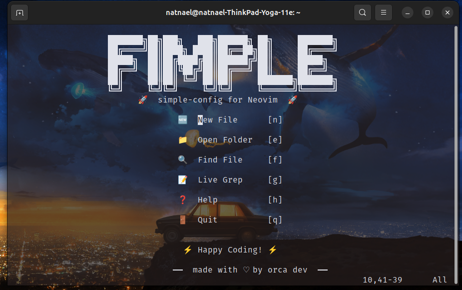

# 🚀 Neovim Configuration

### _Clean, Fast & Transparent — built by orca dev_

A minimal, modern, and beautiful Neovim setup with a custom dashboard, transparency, and essential tools for web development.  
Perfect for **JavaScript/TypeScript**, **React**, or anyone who wants a fast, good-looking editor out of the box.

> 💡 No bloat. No config tweaking. Just works.

---

## 🖼️ Dashboard Preview



This is what you see when you launch Neovim — fast, clean, and intuitive.

---

## ✨ Features

- 🏠 **Custom Dashboard** – Branded startup screen
- 🔍 **Telescope** – Fuzzy find files & grep
- 📁 **NvimTree** – File explorer with icons
- 💄 **Prettier Integration** – Auto-format JS/TS
- 🧩 **Snippets** – Powered by `LuaSnip`
- ⌨️ **Smart Keymaps** – Easy navigation
- 🌫️ **Transparent UI** – Blends with your terminal
- 🛠️ **Zero Setup** – Drop-in config

---

## 📦 Installation (Linux Only)

> ⚠️ This config is designed for **Linux** and must be placed in `~/.config/nvim`.

### 1. Backup your current Neovim config (optional)

```bash
mv ~/.config/nvim ~/.config/nvim.bak
```

### 2. Clone this config into the right location

```bash
git clone https://github.com/Natnsis/simple_neovim_configuration.git ~/.config/nvim
```

> 💡 This repo will be your nvim configuration. You can think of it as your personal nvim setup.

### 3. Launch Neovim and install plugins

```bash
nvim
```

> Then run if the plugins don't start installing on initialization:(write it in nvim/ dont copy paste)

```bach
:Lazy sync
```

> Just wait a few seconds — no extra commands needed! 🎉

## 🌫️ Terminal Transparency Guide

This config is designed to have a **clean, transparent UI** — including the built-in terminal (`:terminal`), floating windows (like Telescope or file explorer), and popups.

But **true transparency depends on your terminal emulator**, not just Neovim.

### ✅ How It Works

- Neovim removes background colors from UI elements
- Your **terminal emulator** must support transparency
- The result: Neovim blends into your desktop background

---

### 🖥️ How to Enable Transparency

#### 1. Use a Compatible Terminal(works normal on default gnome linux distro terminals)

| Terminal                              | Supports Transparency?   |
| ------------------------------------- | ------------------------ |
| **GNOME Terminal** (on X11)           | ✅ Yes                   |
| **Kitty**                             | ✅ Yes (best experience) |
| **Alacritty**                         | ✅ Yes                   |
| **Windows Terminal**                  | ✅ Yes (with acrylic)    |
| **iTerm2 (macOS)**                    | ✅ Yes                   |
| **Wayland (default on newer Ubuntu)** | ❌ No — use X11          |

> 💡 Tip: Check your session type with:
>
> ```bash
> echo $XDG_SESSION_TYPE
> ```
>
> Should say `x11`, not `wayland`.

---

#### 2. Enable Opacity

##### For GNOME Terminal:

1. Open **Terminal → Preferences**
2. Go to **Colors**
3. Adjust **Background opacity** to `70–80%`

##### For Kitty:

Add to `~/.config/kitty/kitty.conf`:

```conf
background_opacity 0.9
```

##### For Alacritty:

window:
opacity: 0.9

```conf
background_opacity 0.9
```

### 🚀 What You’ll See

- `:terminal` in Neovim will be **see-through**
- Telescope, NvimTree, and popups will **blend smoothly**
- Overall UI feels **lightweight and immersive**

> 🔥 Pro tip: Pair with a **dark wallpaper** and **Nerd Font** for maximum vibe.

---

### ❗ Troubleshooting

| Issue                             | Fix                                                                      |
| --------------------------------- | ------------------------------------------------------------------------ |
| Solid background in `:terminal`   | Make sure your terminal emulator supports transparency                   |
| Transparency breaks after startup | Your colorscheme may reset `Normal` bg — ensure it supports transparency |
| Using Wayland?                    | Switch to **X11 session** at login (gear icon)                           |

🚀 **Launch Neovim. Breathe. Code.**  
This isn't just a config — it's your new flow.
